# Nepdora System Design

## 1. Executive Summary

Nepdora is a multi-tenant website builder and commerce platform built on **Next.js App Router**. This repository is primarily the **frontend platform and orchestration layer** for:

- The public Nepdora marketing website
- Site-owner authentication, onboarding, admin, builder, preview, and publish experiences
- Published tenant websites on subdomains and custom domains
- Customer-facing browsing, login, profile, orders, wishlist, checkout, and payment flows
- Superadmin management
- Integration orchestration for payments, custom domains, media upload, analytics, Facebook Messenger, and webhooks

Important architectural fact:

- **This repo is not the full backend system.**
- Most business data is served by an external backend API configured through `NEXT_PUBLIC_API_BASE_URL`.
- This frontend sends tenant-aware requests to that backend using `X-Tenant-Domain`.
- A few edge/orchestration responsibilities are handled directly inside this Next.js app through route handlers and server actions.

Because of that, this document describes:

- What is definitively implemented in this repository
- What is inferred about the backend contract from the frontend integration code

---

## 2. High-Level Architecture

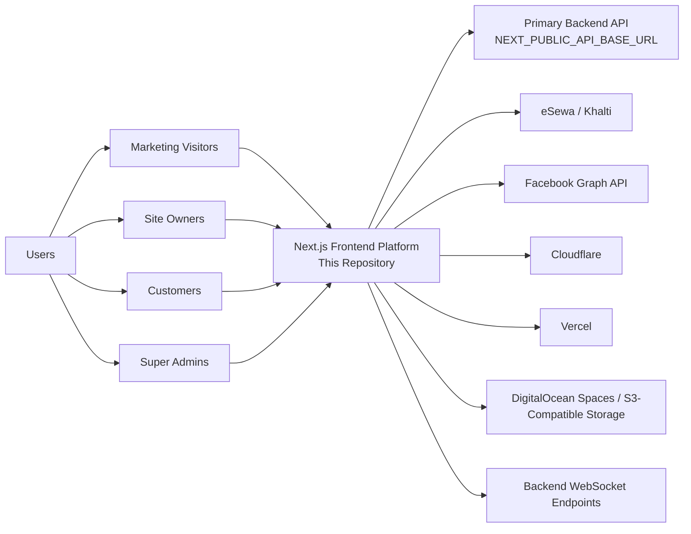

### Core architectural idea

Nepdora uses **host-based multi-tenancy**:

- `nepdora.com` serves the main marketing and platform pages
- `tenant.nepdora.com` serves tenant-specific preview, admin, builder, and published traffic
- custom domains are reverse-mapped to a tenant and internally rewritten to the correct tenant publish route

The frontend decides which tenant a request belongs to, then forwards that tenant context to the backend using request headers.

---

## 3. Major Product Surfaces

The app is organized into several runtime surfaces:

### 3.1 Marketing Surface

Route groups under:

- `src/app/(marketing)`

Purpose:

- Main Nepdora website
- SEO landing pages
- pricing, features, integrations, comparison pages, tools, glossary, blog, use-cases

### 3.2 Authentication Surface

Routes under:

- `src/app/(auth)`
- `src/app/auth/google`

Purpose:

- site-owner login/signup
- Google OAuth
- password reset / verification flows
- logout

### 3.3 Site Owner Surface

Routes under:

- `src/app/(siteowners)/admin`
- `src/app/(siteowners)/builder`
- `src/app/(siteowners)/preview`
- `src/app/(siteowners)/publish`
- `src/app/(siteowners)/on-boarding`

Purpose:

- tenant administration
- visual builder
- live preview
- published site rendering
- onboarding

### 3.4 Customer Surface

Spread across publish/preview tenant routes and customer contexts/hooks:

- login/signup
- profile
- wishlist
- orders
- reviews
- checkout-related pages

### 3.5 Superadmin Surface

Routes under:

- `src/app/superadmin`

Purpose:

- user management
- domain oversight
- payments
- blog/newsletter/contact/testimonials/template administration

### 3.6 Local Orchestration API Surface

Routes under:

- `src/app/api/*`

Purpose:

- payment initiation/verification
- Facebook auth and messaging bridge
- webhook ingestion
- S3 upload
- Open Graph image generation
- small utility endpoints

---

## 4. Repository-Level Architecture

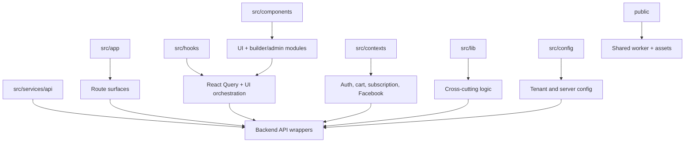

### Folder responsibilities

- `src/app`: route entry points and server-side page/layout logic
- `src/components`: reusable UI, builder components, admin screens, marketing sections
- `src/services/api`: typed wrappers around backend endpoints
- `src/hooks`: query hooks, mutations, UI orchestration, socket usage
- `src/contexts`: auth, customer auth, cart, subscription, Facebook, POS
- `src/lib`: utilities, cache logic, payment adapters, publish revalidation, domain actions
- `src/config`: frontend/server tenant and API configuration
- `public/websocket-worker.js`: SharedWorker for builder/preview real-time socket fanout

---

## 5. Runtime Boundaries

This system has three major runtime layers.

### 5.1 Browser Runtime

Runs:

- React UI
- React Query
- auth contexts
- builder and admin interactions
- customer flows
- shared worker socket client

### 5.2 Next.js Server Runtime

Runs:

- App Router pages/layouts
- server components
- route handlers in `src/app/api`
- server actions for revalidation and domain provisioning
- publish caching and metadata generation

### 5.3 External Backend Runtime

Inferred from integrations:

- stores users, tenants, pages, components, products, services, orders, blogs, payments, domain mappings, plugin configs, etc.
- exposes tenant-aware REST APIs
- exposes WebSocket endpoints for live builder/preview updates

---

## 6. Multi-Tenant Routing Model

The most important infrastructure behavior in this repo is implemented in `src/proxy.ts`.

### 6.1 What the proxy does

The proxy:

- extracts subdomains from the incoming host
- detects custom domains
- maps custom domains back to the owning tenant
- rewrites tenant traffic to internal App Router routes
- prevents cross-tenant access to admin/builder/preview routes
- persists auth tokens from query parameters into cookies when cross-domain login redirects occur

### 6.2 Request classification

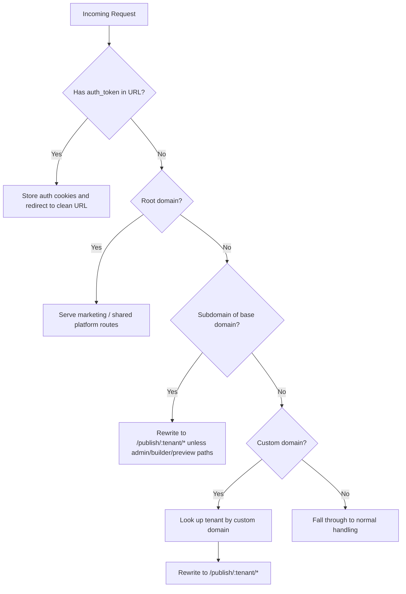

### 6.3 Tenant isolation

The proxy also validates:

- current host tenant
- builder/preview path tenant
- authenticated user tenant from cookies/JWT

If they do not match, the user is redirected to:

- `/permission-denied`

This is a critical protection against cross-tenant administration.

---

## 7. Tenant Context Propagation

Most backend requests are tenant-aware.

### 7.1 Mechanism

Frontend requests use:

- `X-Tenant-Domain`

This header is injected by:

- `src/lib/api-client.ts`
- `src/config/server-site.ts`

### 7.2 Tenant resolution rules

On the client, the tenant domain is derived from:

- current host
- preview path
- subdomain

On the server, tenant context is usually derived from:

- auth cookies / JWT
- request headers

### 7.3 Why this matters

The same backend serves many tenant datasets. The frontend must always tell the backend which tenant the request belongs to.

---

## 8. Authentication Architecture

There are two parallel auth models:

- site-owner/platform auth
- customer auth

### 8.1 Site-owner auth

Main code:

- `src/contexts/AuthContext.tsx`
- `src/services/auth/api.ts`
- `auth.ts`
- `src/hooks/use-jwt-server.ts`

Capabilities:

- email/password login
- signup
- refresh token flow
- Google OAuth
- cross-subdomain auth persistence
- cookie + localStorage hydration

### 8.2 Customer auth

Main code:

- `src/contexts/customer/AuthContext.tsx`
- `src/services/auth/customer/api.ts`

Capabilities:

- customer login/signup
- token storage in localStorage
- redirect back into publish/preview tenant pages

### 8.3 Auth data stores

For site owners:

- cookies: `authToken`, `refreshToken`, `authUser`
- localStorage: `authTokens`, `authUser`

For Google auth temporary bridging:

- `google_auth_token`
- `google_auth_refresh_token`
- `google_auth_user`
- `google_auth_sub_domain`

For customers:

- localStorage: `customer-authTokens`

### 8.4 Auth flow

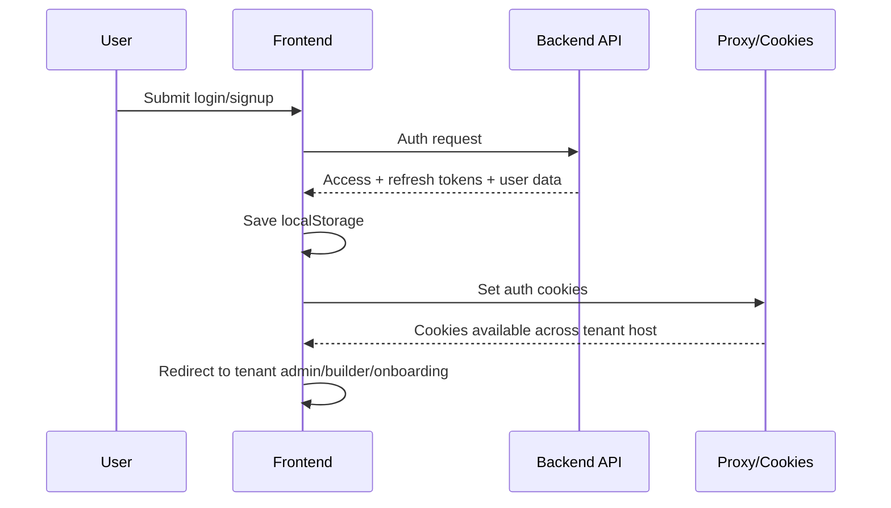

### 8.5 Google OAuth flow

Google auth uses NextAuth as the OAuth shell, but login completion still depends on the backend.

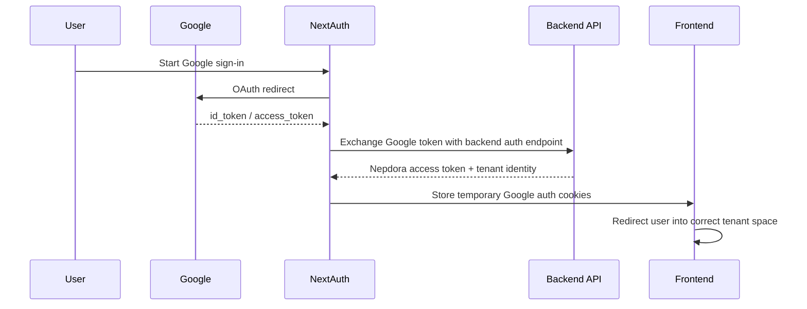

### 8.6 Server-side auth reading

Server components do not rely on client state. They decode cookies/JWT using:

- `getServerUser()`

This is what protects:

- admin layout
- preview layout
- subscription verification flow

---

## 9. Onboarding Flow

Main code:

- `src/app/(siteowners)/on-boarding`
- `src/services/auth/onboarding.ts`

### Flow

1. user signs up or logs in for the first time
2. auth context identifies onboarding status
3. onboarding UI collects required business/store data
4. frontend calls backend `complete-onboarding`
5. user is redirected to admin when complete

This onboarding status is represented in JWT/user fields such as:

- `first_login`
- `is_onboarding_complete`
- `has_profile_completed`

---

## 10. Site Owner Admin System

The admin area is the tenant control center.

### 10.1 Access control

Admin layout:

- requires authenticated server-side user
- wraps pages in subscription provider
- always renders subscription blocker

### 10.2 Main admin modules

Based on the codebase, admin includes:

- dashboard and stats
- products and inventory
- services
- collections
- categories and subcategories
- blogs
- portfolio
- testimonials
- banners
- videos
- customers
- orders
- appointments and bookings
- newsletter and contacts
- popup inquiries
- profile and account settings
- domain settings
- plugins and integrations
- Messenger / Facebook
- payments and subscription history
- POS-related tools

### 10.3 Data pattern

The admin UI consistently uses:

- React Query hooks in `src/hooks/owner-site/admin/*`
- API service wrappers in `src/services/api/owner-sites/admin/*`
- backend REST endpoints

The admin itself is mostly a thin but structured control plane over backend resources.

---

## 11. Builder Architecture

The builder is the most product-defining feature in this repository.

### 11.1 Builder goals

The builder allows a tenant to:

- manage pages
- add/remove/reorder sections
- swap section templates
- edit component data
- manage navbar/footer/theme
- update SEO metadata
- preview unpublished changes
- publish the site

### 11.2 Builder component system

The builder is driven by a registry in:

- `src/types/owner-site/components/registry.tsx`

This registry maps:

- component type id
- display name
- category
- default data factory
- React component implementation

### 11.3 Builder-supported content domains

From the registry and component folders, the system supports component families such as:

- hero
- about
- blog
- products
- contact
- appointment
- team
- testimonials
- faq
- portfolio
- banner
- newsletter
- videos
- gallery
- services
- pricing
- CTA
- policies
- text editor
- collections
- socials
- skills
- tours
- countries
- auth forms
- checkout
- order confirmation
- detail pages for product/blog/service/portfolio

### 11.4 Builder flow

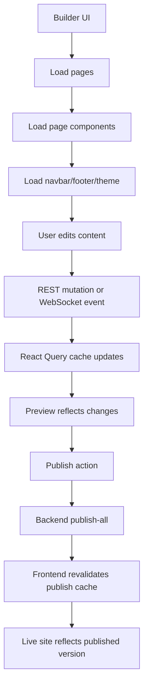

### 11.5 Real-time builder/preview sync

Builder and preview use:

- `WebsiteSocketProvider`
- `useWebsiteSocket`
- `public/websocket-worker.js`

The socket system:

- opens one shared WebSocket per tenant schema via SharedWorker when available
- broadcasts socket events across tabs
- updates React Query caches on page/component/theme/navbar/footer events
- allows preview and builder experiences to stay synchronized

### 11.6 Why the SharedWorker exists

Without it, every tab would open its own socket and each UI would manage state independently.

With it:

- one tenant socket can serve multiple tabs
- messages are broadcast to all connected tabs
- connection reuse is improved
- preview/builder collaboration feels more live

---

## 12. Preview vs Publish Model

Nepdora separates **draft/preview** from **published/live**.

### 12.1 Preview mode

Preview pages:

- use authenticated access
- use live backend preview APIs
- enable real-time socket updates
- read draft components

### 12.2 Publish mode

Published pages:

- are public
- use cached server-side fetches
- disable sockets
- fetch published navbar/footer/theme/pages/components
- use Next.js revalidation tags

### 12.3 Preview/publish comparison

| Concern           | Preview                      | Publish                     |
| ----------------- | ---------------------------- | --------------------------- |
| Access            | authenticated                | public                      |
| Data source       | preview/draft backend state  | published backend state     |
| Real-time updates | yes                          | no                          |
| Fetch model       | client + hydrated query data | server-side cached fetch    |
| Cache strategy    | query cache                  | Next.js `revalidate` + tags |

### 12.4 Publish cache model

Main implementation:

- `src/lib/publish-page-cache.ts`
- `src/lib/actions/publish-revalidation.ts`

The publish path uses:

- per-tenant tags like `tenant:<siteUser>:site`
- time-based revalidation
- explicit tag invalidation after publish

### 12.5 Preview to publish sequence

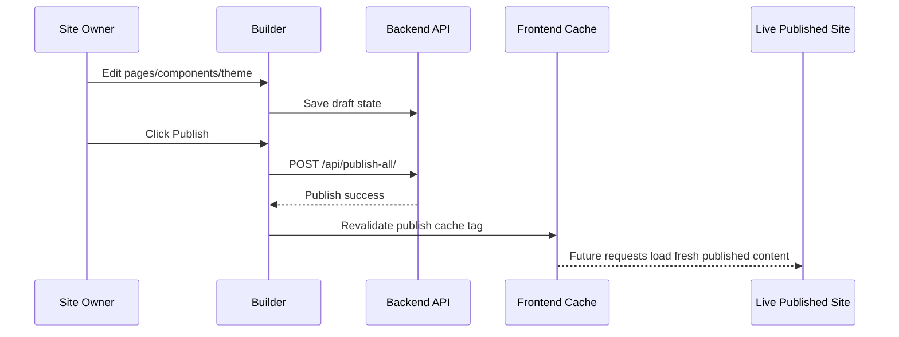

---

## 13. Content and Page Model

The page system is component-driven.

### 13.1 Core content entities inferred from frontend contracts

- pages
- page components
- navbar
- footer
- theme
- products
- categories / subcategories
- services
- blogs
- portfolio
- collections
- testimonials
- pricing
- popup / newsletter / contact modules

### 13.2 Page composition

A page is effectively:

- page metadata
- ordered list of section components
- shared layout components
- theme data

### 13.3 Dynamic detail pages

Publish routing supports dynamic content slugs for:

- product details
- blog details
- service details
- portfolio details

This means the live site can render reusable content templates that are bound to backend entities by slug.

---

## 14. Data Fetching Strategy

### 14.1 Client-side fetching

Main stack:

- React Query
- service wrappers under `src/services/api`

Used for:

- admin CRUD
- builder live state
- preview
- customer interactions

### 14.2 Server-side fetching

Main stack:

- server components
- `serverGet/serverPost/serverPatch/serverDelete`
- publish cache fetchers

Used for:

- admin authentication gating
- metadata generation
- public published content fetch
- subscription verification

### 14.3 Error handling

Centralized logic in:

- `src/utils/api-error.ts`

This normalizes:

- field-level validation errors
- conflict/unique errors
- file-related errors
- friendly display messages

---

## 15. Payments Architecture

Nepdora supports two major payment tracks:

- store/customer purchase payments
- tenant subscription payments

Supported gateways:

- eSewa
- Khalti

### 15.1 Why payments are partly handled inside Next.js

The app contains local route handlers for:

- payment initiation
- verification
- central payment history reporting
- redirect URL generation

This frontend acts as a payment orchestration layer between:

- the tenant site
- tenant/backend gateway config
- Nepdora-managed fallback credentials
- payment providers

### 15.2 Store payment initiation flow

Main routes:

- `src/app/api/initiate-payment/route.ts`
- `src/app/api/verify-payment/route.ts`

### 15.3 Subscription payment flow

Main routes:

- `src/app/api/subscription/initiate-payment/route.ts`
- `src/app/api/subscription/verify-payment/route.ts`

### 15.4 Gateway credential model

The system first tries:

- tenant-specific payment gateway config from backend

If tenant credentials are missing, it can fall back to:

- Nepdora-managed central credentials

This is a significant platform design choice because it allows:

- tenant-managed payment mode
- platform-managed payment mode

### 15.5 Payment flow diagram

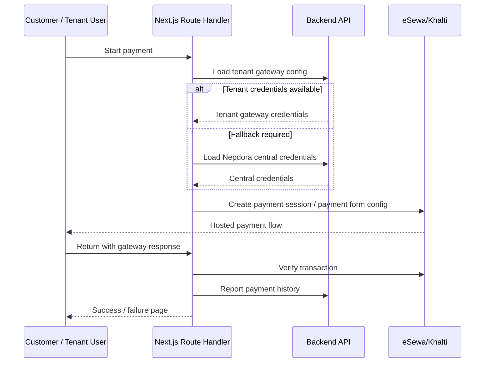

### 15.6 Payment history reporting

After successful verification, the system may report:

- tenant payment history
- Nepdora central payment history

This supports reconciliation for managed gateway mode.

---

## 16. Subscription System

The admin area is subscription-aware.

Main elements:

- `SubscriptionProvider`
- `SubscriptionBlocker`
- subscription history widgets and pages
- dedicated subscription payment pages

Behavior:

- gated features can be blocked when subscription is invalid
- the UI can route users into subscription payment flows
- verification routes use current authenticated tenant identity

This makes subscription state a platform-level concern, not just a billing page concern.

---

## 17. Custom Domain Provisioning

Custom domain setup is a hybrid of backend records plus third-party infra automation.

### 17.1 External systems involved

- Cloudflare
- Vercel
- backend domain records

### 17.2 Main logic

- `src/lib/actions/domain-provisioning-actions.ts`
- `src/lib/actions/cloudflare-actions.ts`
- `src/lib/actions/vercel-actions.ts`

### 17.3 Provisioning flow

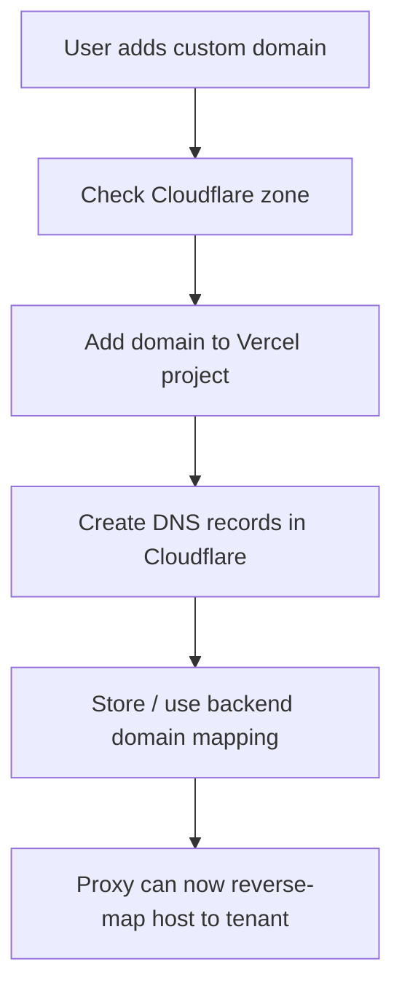

### 17.4 Why this matters

The frontend runtime can only serve a custom domain correctly if:

- the domain points to the deployed frontend
- the backend knows which tenant owns the domain
- the proxy can reverse-resolve the host to a tenant subdomain

### 17.5 Deprovisioning flow

Removal attempts to clean up in this order:

- Vercel domain
- Cloudflare DNS/zone
- backend domain record

---

## 18. Media Upload Architecture

Media upload uses an S3-compatible backend, apparently DigitalOcean Spaces.

### 18.1 Main pieces

- browser upload utilities in `src/utils/s3.ts`
- local upload route in `src/app/api/upload/s3/route.ts`
- media library dialogs and upload hooks

### 18.2 Upload flow

1. browser optionally compresses large images
2. file is posted to backend S3 upload endpoint or the local upload route depending on feature path
3. object is stored under a folder/prefix
4. public URL is returned
5. builder/admin stores that URL in content data

### 18.3 Media design choices

- public-read object URLs
- folder-based organization
- client-side compression for large images

---

## 19. Facebook Integration and Messaging

The Facebook integration is one of the more complex orchestration areas in this repo.

### 19.1 Responsibilities in this repo

- OAuth callback handling
- page/app webhook subscription
- conversation fetching
- sending messages
- receiving webhook events
- streaming real-time updates into the admin messenger UI

### 19.2 Main components

- `src/app/api/facebook/callback/route.ts`
- `src/app/api/facebook/conversations/route.ts`
- `src/app/api/facebook/send-message/route.ts`
- `src/app/api/webhook/route.ts`
- `src/app/api/facebook/messages/stream/route.ts`
- `src/services/facebook/facebook.service.ts`
- `src/lib/facebook.ts`
- `src/lib/message-store.ts`

### 19.3 Messaging flow

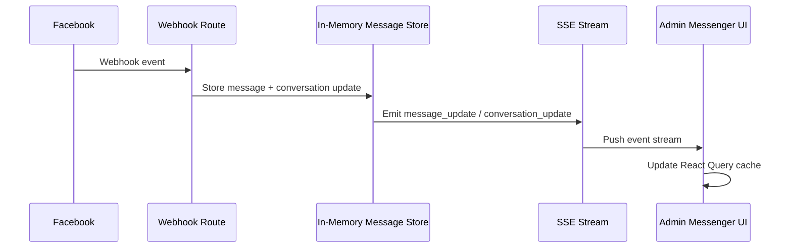

### 19.4 Real-time design choice

The Messenger system uses:

- webhook ingestion from Facebook/backend
- in-memory message store
- SSE stream to browser admin clients

This is separate from the builder socket system.

### 19.5 Important architectural limitation

The message store is in-memory inside the Next.js server process.

That means:

- it works best for short-lived real-time fanout
- it is not a durable message source
- horizontal scaling would require a shared event bus or persistent real-time backend for stronger guarantees

---

## 20. SEO and Metadata System

SEO is treated as a first-class feature.

### 20.1 Implemented capabilities

- route-level metadata generation
- dynamic metadata from page components
- OG image route
- marketing SEO pages
- tenant publish metadata
- schema support
- sitemap and robots routes

### 20.2 Publish metadata flow

Published pages fetch:

- page title
- meta title
- meta description
- image candidates from components or entities

This is assembled through:

- `src/lib/metadata-utils.ts`
- `src/lib/publish-page-cache.ts`

---

## 21. Real-Time Systems Summary

Nepdora uses two distinct real-time patterns.

### 21.1 Builder/preview real-time

Mechanism:

- WebSocket + SharedWorker

Use cases:

- page/component create/update/delete
- theme/navbar/footer updates
- multi-tab preview sync

### 21.2 Messenger real-time

Mechanism:

- webhook ingestion + in-memory event bus + SSE

Use cases:

- new Messenger conversations/messages in admin UI

### 21.3 Why two systems exist

They solve different problems:

- builder sockets are tenant-state synchronization against the platform backend
- Messenger SSE is event fanout from external message ingestion

---

## 22. Environment and Integration Dependencies

The system depends on several categories of configuration.

### 22.1 Core platform config

- API base URL
- base domain
- protocol
- frontend port

### 22.2 Auth config

- Google OAuth client id/secret
- redirect URIs

### 22.3 Payment config

- eSewa merchant and secret
- Khalti secret

### 22.4 Infrastructure config

- Vercel token/project/team
- Cloudflare token/account
- S3/Spaces credentials, bucket, endpoint

### 22.5 Social/Messaging config

- Facebook app id/secret
- webhook verify token
- API version

### 22.6 Analytics/AI config

- Google Analytics
- Wit.ai token

Operational note:

- these values are highly sensitive and should be managed outside version control in production-grade secret storage

---

## 23. Deployment Model

From the code, the intended deployment model is:

- Next.js frontend deployed on Vercel or equivalent
- backend API deployed separately
- custom domains added to the frontend deployment
- DNS managed through Cloudflare
- published tenant content served through the same frontend runtime using internal rewrites

### Request serving modes

- root domain traffic: marketing/platform
- tenant subdomain traffic: preview/admin/builder/publish depending on path
- custom domain traffic: publish, reverse-mapped by proxy

---

## 24. End-to-End Flow Catalog

### 24.1 Marketing visitor flow

1. visitor lands on root domain
2. marketing pages render from App Router
3. static/SEO content is served
4. CTA leads into auth/signup flow

### 24.2 Site-owner signup and onboarding flow

1. user signs up via email/password or Google
2. backend issues tenant-aware JWT
3. cookies/localStorage are populated
4. proxy and auth context identify tenant
5. onboarding completes required setup
6. user enters admin/builder

### 24.3 Builder flow

1. builder route loads tenant page slug
2. pages/components/layout/theme load
3. user edits content and structure
4. mutations are sent to backend
5. query cache and socket events update UI
6. preview reflects draft state

### 24.4 Publish flow

1. owner clicks publish
2. frontend calls backend publish endpoint
3. frontend revalidates publish cache tags
4. public requests see new published state

### 24.5 Customer browse and checkout flow

1. customer visits tenant published site
2. pages/components are rendered from published cache
3. customer adds items / browses products
4. payment initiation route creates provider session
5. provider returns result
6. verification route validates and records payment

### 24.6 Subscription payment flow

1. tenant admin selects plan
2. subscription payment page calls subscription initiation route
3. user completes provider payment
4. verification route confirms result
5. subscription history / state is updated downstream

### 24.7 Custom domain setup flow

1. tenant requests custom domain
2. Cloudflare zone is checked/created
3. domain is added to Vercel
4. DNS records are created
5. backend domain mapping exists
6. proxy resolves host to tenant publish site

### 24.8 Facebook Messenger flow

1. tenant connects Facebook page
2. callback route exchanges token and subscribes webhooks
3. webhook events arrive
4. message store emits updates
5. SSE pushes updates to admin messenger UI

---

## 25. Strengths of the Current Design

- clear host-based multi-tenant model
- strong separation between preview and publish
- good use of App Router server rendering for public content
- React Query for consistent admin/builder data handling
- registry-driven builder architecture
- practical fallback model for managed payments
- custom domain automation integrated into the product
- real-time preview synchronization

---

## 26. Architectural Constraints and Risks

These are important to understand when evolving the system.

### 26.1 Backend dependency is very high

This repo depends on a large external API surface. Frontend correctness assumes stable backend contracts.

### 26.2 In-memory messaging is not durable

The Messenger real-time store is process-local and not ideal for multi-instance, restart-tolerant event delivery.

### 26.3 Mixed orchestration responsibilities

This frontend handles:

- UI
- auth bridging
- payment orchestration
- domain automation
- Facebook callback logic

That is powerful, but it also means operational complexity is spread into the frontend deployment.

### 26.4 Host/cookie/subdomain complexity

Cross-domain auth and tenant routing are carefully handled, but this area is naturally fragile and should be tested heavily around:

- custom domains
- localhost subdomains
- preview/admin redirects
- Google auth callbacks

### 26.5 Secret handling discipline is critical

The platform integrates with several privileged third-party systems. Secret hygiene is essential.

---

## 27. Recommended Mental Model for the Whole System

The cleanest way to think about Nepdora is this:

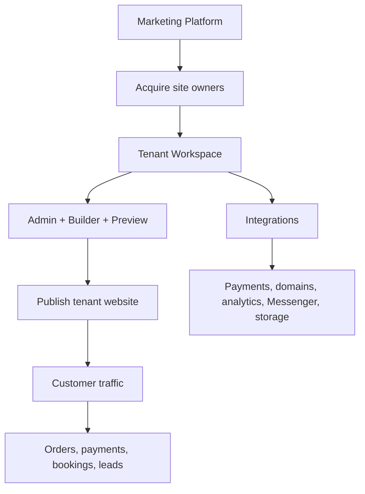

In other words:

- Nepdora first acquires businesses through the marketing site
- then creates a tenant workspace for each business
- that workspace is managed through admin + builder + preview
- publishing turns that workspace into a public website
- integrations extend that website into a commerce/operations platform

---

## 28. Source-of-Truth Notes

This document is based on direct inspection of this repository, especially:

- `src/proxy.ts`
- `src/config/*`
- `auth.ts`
- `src/contexts/*`
- `src/services/api/*`
- `src/lib/publish-page-cache.ts`
- `src/lib/actions/*`
- `src/app/(siteowners)/*`
- `src/app/api/*`
- `src/services/facebook/*`
- `public/websocket-worker.js`

### Important boundary note

Where backend internals are not present in this repository, this document describes them as:

- inferred backend behavior
- inferred data models
- inferred publish/payment/domain lifecycle

That is the correct way to read this system design: it is a **frontend-and-orchestration system design** for the full Nepdora platform, with backend internals described from the contracts visible here.

---

## 29. Final Summary

Nepdora is a **multi-tenant website builder + commerce frontend platform** with five major architectural pillars:

1. **Host-based tenant routing**
2. **Draft vs published site separation**
3. **Registry-driven visual builder**
4. **Backend API as the main business-data source**
5. **Frontend orchestration for payments, domains, media, and Messenger**

That combination makes this repository much more than a website frontend. It is the platform shell that:

- routes tenants
- manages identity
- drives the builder
- renders live published sites
- coordinates third-party integrations
- and bridges the user-facing product experience to the backend system
